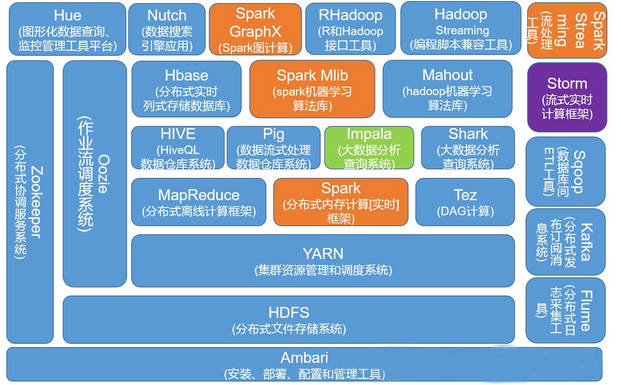

# 搭建大数据系统

环境 | 版本 
----- | ----- 
jdk  | open-jdk-1.8.0_181-b13
Hadoop | 2.7.7
HBase | 2.0.2
Spark | 1.5.2

服务器 | 服务角色 | 服务组件
----- | ----- | ----- 
节点1  | Hadoop master , Hadoop slave    HBase master    Spark master, Spark worker| NameNode , DataNode , SecondaryNameNode , NodeManager , ResourceManager
节点2   | Hadoop slave   HBase RegionServer    Spark worker | DataNode , NodeManager

# 1. Hadoop 
 1. [Hadoop 自动部署搭建](./hadoop_auto/)

# 2. HBase
 1. [HBase 系统 自动部署搭建](./hbase/)

# 3. Spark
 1. [Spark 系统 部署搭建](./spark/)

----------------------------------------

**项目规范**

本文使用 [`Markdown`](https://www.markdownguide.org/basic-syntax) 编写, 排版符合[`中文技术文档写作规范`](https://github.com/hbulpf/document-style-guide)。Find Me On [**Github**](https://github.com/hbulpf/HadoopLab) , [**Gitee**](https://gitee.com/sifangcloud/HadoopLab)

**友情贡献**

@[**RunAtWorld**](http://www.github.com/RunAtWorld)  &nbsp; 

